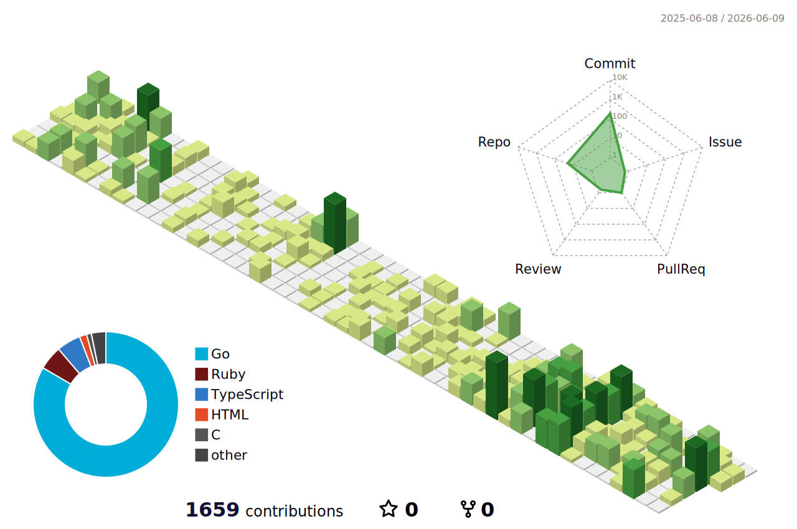

<!-- ===== HEADER ===== -->

  

 

**🎓 Studying Behavioral Economics at Meiji University**  
**💼 Software Engineer at Howtelevision**  
**🌱 Building elegant systems with curiosity and purpose**

 

<!-- ===== TECH STACK ===== -->
## 🛠 Tech Stack

**Languages**

**Frameworks & Libraries**

**Infrastructure & Tools**

 

<!-- ===== 3D CONTRIBUTIONS ===== -->
## 🧊 3D Contributions

  

 

<!-- ===== GITHUB STATS ===== -->
## 📊 GitHub Stats

  
  &nbsp;&nbsp;
  

 

<!-- ===== STREAK STATS ===== -->

  

 

<!-- ===== ACTIVITY GRAPH ===== -->

  

---

  

Building elegant systems with curiosity, discipline, and purpose.

